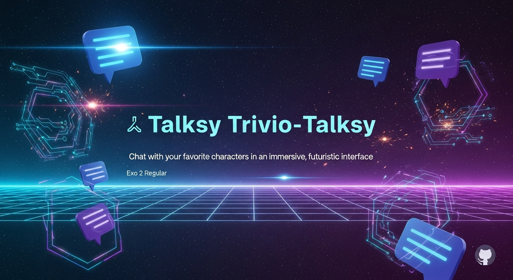

<div align="center">


# 🌟 Talksy Trivio-Talksy

### *Chat with your favorite fictional characters in an immersive, futuristic experience*

[](https://github.com/Google-Developers-Group-IIITDMK/talksy_trivio-talksy/graphs/contributors)
[](https://github.com/Google-Developers-Group-IIITDMK/talksy_trivio-talksy/network/members)
[](https://github.com/Google-Developers-Group-IIITDMK/talksy_trivio-talksy/stargazers)

[Report Bug](https://github.com/Google-Developers-Group-IIITDMK/talksy_trivio-talksy/issues) | [Request Feature](https://github.com/Google-Developers-Group-IIITDMK/talksy_trivio-talksy/issues)

</div>

<div align="center">
  
</div>

## ✨ Overview

**Talksy Trivio-Talksy** is a cutting-edge web application that brings fictional characters to life through an immersive chat experience. Using a futuristic video-call interface with holographic effects, dynamic backgrounds, and responsive animations, users can have natural conversations with their favorite fictional personalities.

Whether you want to discuss wizardry with Voldemort, technology with Iron Man, or adventure with Doraemon, Talksy creates an engaging, personalized interaction that makes each character feel authentic and present.

## 🚀 Key Feature

- **🎭 Character Selection** - Browse through a catalog of iconic fictional personalities
- **🗣️ Voice Interaction** - Talk naturally with characters using speech recognition
- **📱 Responsive Design** - Seamlessly works across desktop, tablet, and mobile
- **🌈 Dynamic Themes** - Each character has unique visual styles and animations
- **💬 Real-time Subtitles** - Follow conversations with neon-styled text animations
- **🎛️ Holographic Controls** - Futuristic floating UI elements for a sci-fi experience
- **🔒 User Accounts** - Save favorite characters and conversation history

## 🖥️ Tech Stack

<div align="center">
  
| Frontend | Styling | Backend | Tools |
|:--------:|:-------:|:-------:|:-----:|
|  |  |  |  |
|  |  |  |  |
|  |  |  |  |
  
</div>

## 🧠 Character Showcase

<div align="center">
  <table>
    <tr>
      <td align="center">
        
        <br/><b>Lord Voldemort</b>
      </td>
      <td align="center">
        
        <br/><b>Doraemon</b>
      </td>
    </tr>
    <tr>
      <td>
        <ul>
          <li>Theme: Dark slate & emerald green</li>
          <li>Voice: Cold, deliberate speech</li>
          <li>Effects: Smoky wisps, shadowy aura</li>
          <li>Personality: Mysterious, commanding</li>
        </ul>
      </td>
      <td>
        <ul>
          <li>Theme: Sky blue & white</li>
          <li>Voice: Friendly, enthusiastic</li>
          <li>Effects: Magical sparkles, portals</li>
          <li>Personality: Helpful, adventurous</li>
        </ul>
      </td>
    </tr>
  </table>
</div>

## 📱 Application Flow
# Join Me:-
<div align="center">
  
</div>

# Play With Me:-
<div align="center">
  
</div>

# Highlights

1. **Splash Screen** - Animated intro with neon logo and particle effects
2. **User Registration** - Glassmorphic form with floating input fields
3. **Character Selection** - Browse and select from available characters
4. **Character Room** - Immersive conversation interface with visual effects
5. **Settings & Preferences** - Customize your experience and save conversations

## 💻 Installation & Setup

### Prerequisites
- Node.js (v16+)
- npm or yarn
- Python 3.8+ (for backend)

### Frontend Setup

```bash
# Clone the repository
git clone https://github.com/Google-Developers-Group-IIITDMK/talksy_trivio-talksy.git

# Navigate to frontend directory
cd talksy_trivio-talksy/talksie

# Install dependencies
npm install

# Start development server
npm run dev
```

### Backend Setup (Optional)

```bash
# Navigate to backend directory
cd ../backend

# Create virtual environment
python -m venv venv
source venv/bin/activate  # On Windows: venv\Scripts\activate

# Install requirements
pip install -r requirements.txt

# Start the backend server
python app.py
```

## 📂 Project Structure

```
talksy_trivio-talksy/
├── talksie/                # Main Frontend (React + Vite)
│   ├── src/
│   │   ├── components/     # React components
│   │   │   ├── SplashScreen/
│   │   │   ├── UserInfoForm/
│   │   │   ├── CharacterSelection/
│   │   │   ├── CharacterRoom/
│   │   │   └── CallControls/
│   │   ├── assets/         # Images, fonts, animations
│   │   ├── App.jsx         # Main application component
│   │   ├── main.jsx        # Application entry point
│   │   └── index.css       # Global styles
│   ├── index.html          # HTML entry point
│   ├── package.json        # Dependencies and scripts
│   ├── vite.config.js      # Vite configuration
│   └── tailwind.config.js  # TailwindCSS configuration
│
└── backend/                # Python Backend (Optional)
    ├── app.py              # Main Flask application
    ├── models/             # Character AI models
    ├── utils/              # Helper functions
    └── requirements.txt    # Python dependencies
```

## 🎮 Interactive Features

<div align="center">
<table>
  <tr>
    <td width="50%">
      <h3>Character Room Features</h3>
      <ul>
        <li>🎭 Dynamic character expressions based on conversation</li>
        <li>💬 Real-time subtitles with neon glow effects</li>
        <li>🌈 Animated background that responds to conversation tone</li>
        <li>⚡ Energy visualizations when the character is "thinking"</li>
        <li>📊 Conversation history with timeline visualization</li>
      </ul>
    </td>
    <td width="50%">
      <h3>Controls & Settings</h3>
      <ul>
        <li>🎛️ Holographic floating control panel</li>
        <li>🔊 Voice recognition with visual feedback</li>
        <li>⚙️ Customizable UI themes and animations</li>
        <li>💾 Save and export conversation highlights</li>
        <li>🧠 Adjust character personality parameters</li>
      </ul>
    </td>
  </tr>
</table>
</div>

## 📊 Future Roadmap

- **🎮 More Characters** - Expanding the character library with new personalities
- **🌐 Multiplayer Mode** - Group conversations with multiple characters
- **🧩 Character Creation** - Build and customize your own AI characters
- **📱 Mobile App** - Native applications for iOS and Android platforms
- **🔊 Voice Customization** - Enhanced voice modulation for characters
- **🎨 AR Integration** - Augmented reality features for mobile users

## 🤝 Contributing

We welcome contributions to Talksy Trivio-Talksy! Whether it's adding new characters, improving UI, or enhancing backend capabilities, your help is appreciated.

1. Fork the repository
2. Create a feature branch (`git checkout -b feature/amazing-feature`)
3. Commit your changes (`git commit -m 'Add amazing feature'`)
4. Push to the branch (`git push origin feature/amazing-feature`)
5. Open a Pull Request

Please check out our [contribution guidelines](CONTRIBUTING.md) for more details.

## 👥 Contributors

<div align="center">
  <a href="https://github.com/Google-Developers-Group-IIITDMK/talksy_trivio-talksy/graphs/contributors">
    
  </a>
</div>

## 📬 Contact

Google Developers Group IIITDMK - [@GDG_IIITDMK](https://twitter.com/GDG_IIITDMK)

Project Link: [https://github.com/Google-Developers-Group-IIITDMK/talksy_trivio-talksy](https://github.com/Google-Developers-Group-IIITDMK/talksy_trivio-talksy)

<div align="center">
  
  <br />
  
  
  
  <p>Created by Team Talksie</a> and the Google Developers Group IIITDMK</p>
  
  <p>Last updated: 2025-09-28</p>
  
</div>
